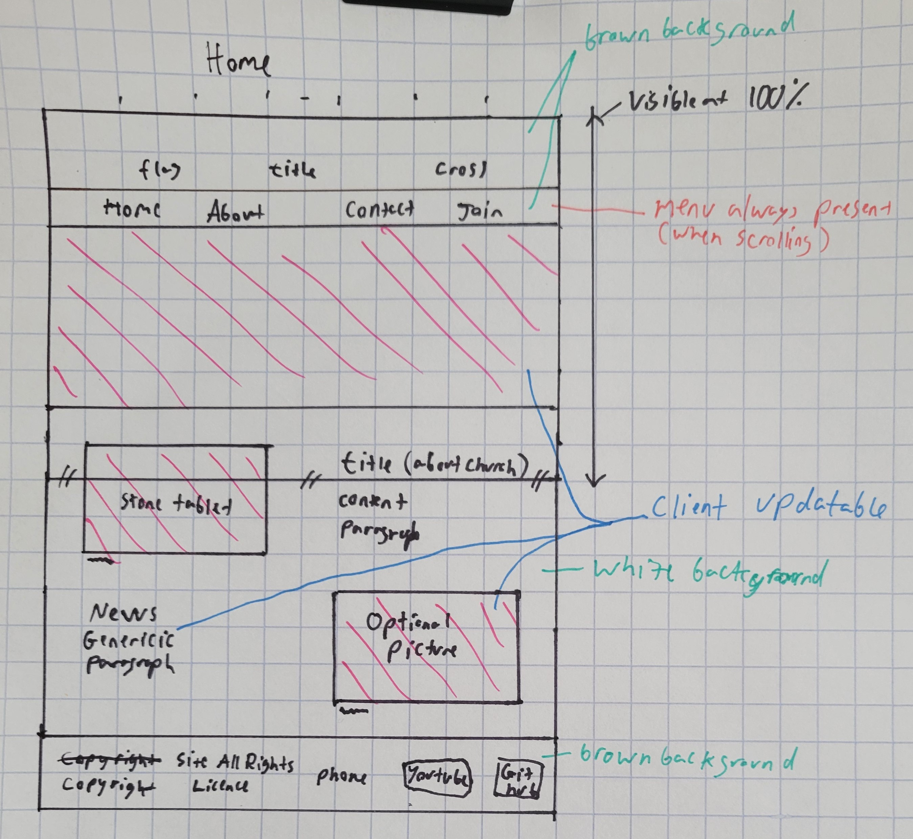

# St. Gabriel Church Website
**Author:** Daniel Asefa 
**GitHub Name:** [CoffeeMug975](https://github.com/CoffeeMug975) 
**GitHub:** [Repository](https://github.com/CoffeeMug975/gabriel-church-website)  

- **Language:** [JavaScript](https://developer.mozilla.org/en-US/docs/Web/JavaScript)
- **Frame Work:** [Next.JS](https://nextjs.org/docs)
- **Styling:** [TailwindCSS](https://tailwindcss.com)
- **Deployment:** [Vercel](https://vercel.com/docs)
- **Other Tech Used:** [Contentful Headless CMS](https://www.contentful.com/developers/docs/)
### Click here to view [Website](https://calgary-ethiopian-orthodox-gabriel.vercel.app)

## Project Overview
Create and deploy website For St. Gabriel Ethiopian Orthodox Church. Include method for client to easily update elements of the website without need for a programmer. This is accomplished by using a *Headless **C**ontent **M**anagement **S**ystem (Contentful)*. 

## Website Details
Certain elements on the websites home page are easily modified with contentful. Those being the video/image that is displayed at the top as well as the news section at the bottom.

## Low-Fidelity-Drawings
### Home

### About

### Contact

### Join Us

